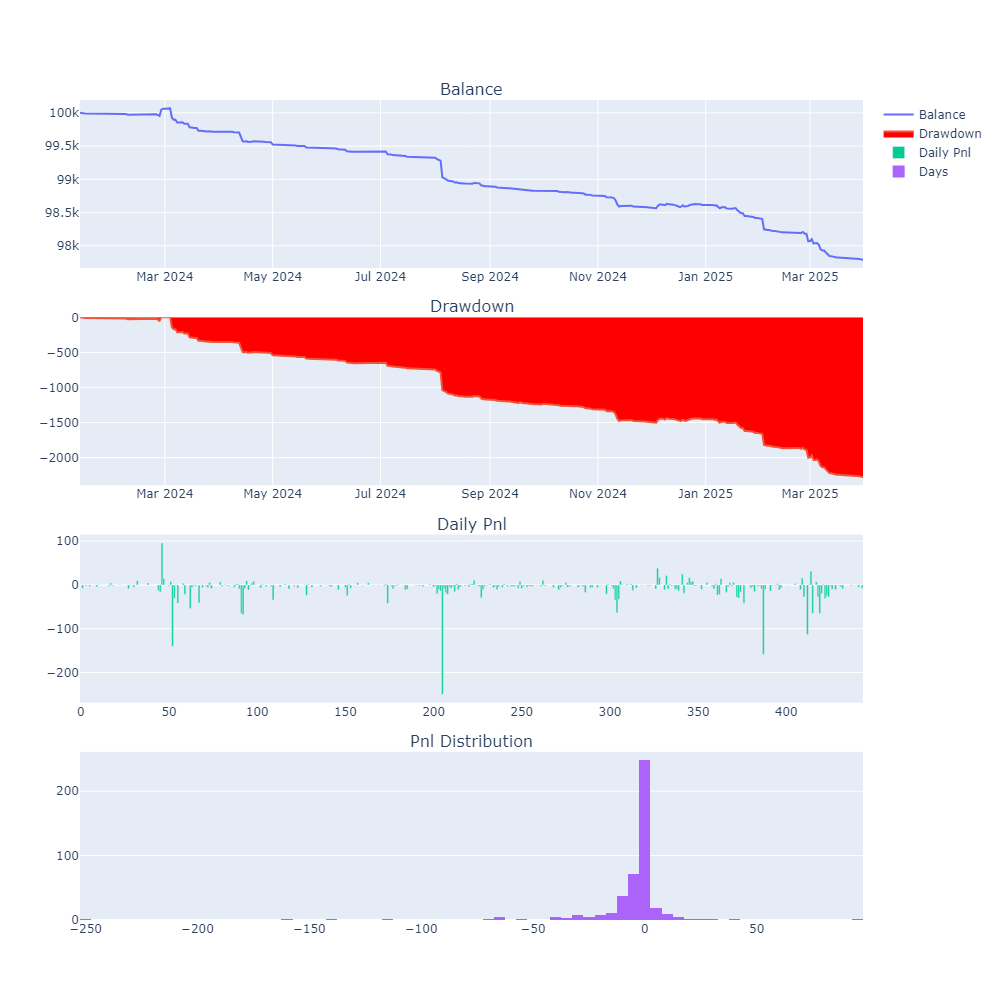
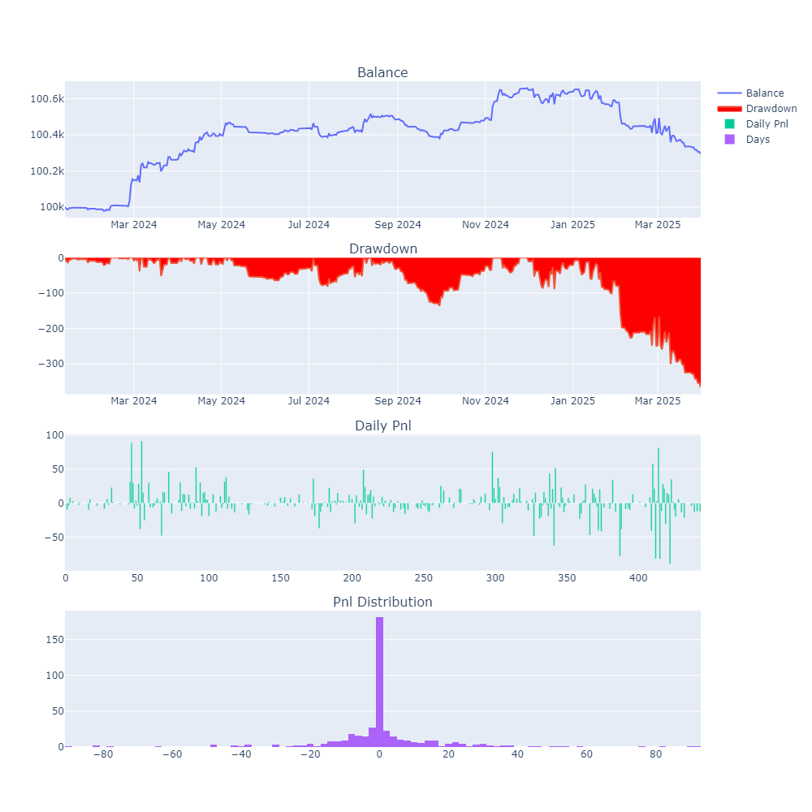
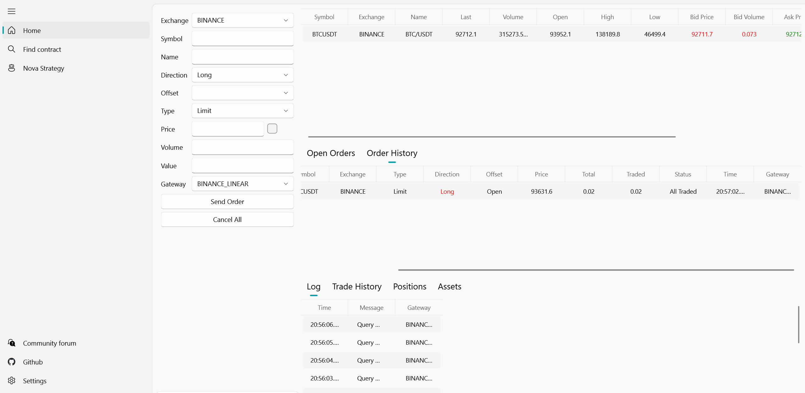
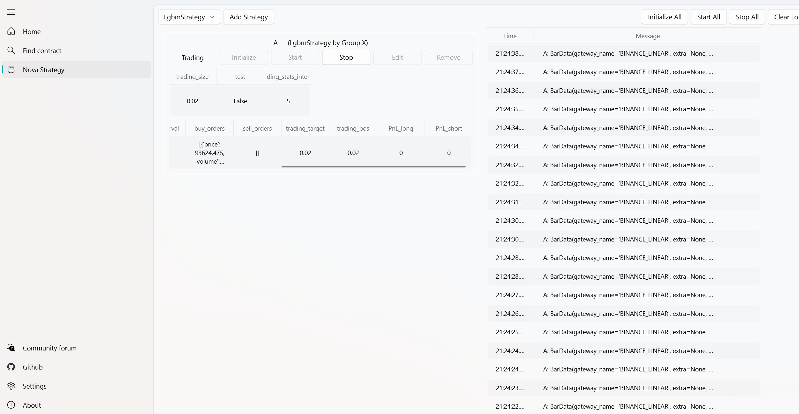

# Vnpy_HFTrading
This is MFE5210 25Spring Project

# Necessary large data files and results
链接: https://pan.baidu.com/s/1enmSmYrYBiK8PpfzRWezOQ?pwd=2jap 提取码: 2jap  
包含了spot data数据库、回测所需的测试集特征及趋势数据、回测策略日志、模拟盘演示视频。

# Get Spot Data from Binance
利用Binance的binance-public-data获取比特币历史(2017.7)以来的快照(Klines)数据，数据频率为1m、3m、5m、15m，数据为24h连续数据，快照数据包括：
| Open time | Open | High | Low | Close | Volume | Close time | Quote asset volume | Number of trades | Taker buy base asset volume | Taker buy quote asset volume | Ignore |
| --- | --- | --- | --- | --- | --- | --- | --- | --- | --- | --- | --- |
| 时间戳(Text) | Real | Real | Real | Real | Real   | 时间戳(Text) | Real | INTEGER | Real | Real | Real |
| 1735689600000000 | 4.15070000 | 4.15870000 | 4.15060000 | 4.15540000 | 539.23000000 | 1735693199999999 | 2240.39860900 | 13 | 401.82000000 | 1669.98121300 | 0 |

获取数据并创建数据库bitcoin_data.db，包含表bitcoin_data_1m，bitcoin_data_3m，bitcoin_data_5m，bitcoin_data_15m。
```bash
python database.py
```
从数据库中获取数据示例，从SQLite数据库中获取bitcoin 2024年1月11号早上8点到下午16点的1m快照数据

```python
import sqlite3
import datetime
import pandas as pd

# 连接到 SQLite 数据库
conn = sqlite3.connect('bitcoin_data.db')
cursor = conn.cursor()

# 定义查询的时间范围
start_time = datetime.datetime(2024, 1, 11, 8, 0, 0)
end_time = datetime.datetime(2024, 1, 11, 16, 0, 0)

# 将时间转换为时间戳(毫秒)
start_timestamp = int(start_time.timestamp())* 1000
end_timestamp = int(end_time.timestamp())* 1000

# 执行 SQL 查询
query = f"SELECT * FROM bitcoin_data_1m WHERE CAST(Open_time AS INTEGER) >= {start_timestamp} AND CAST(Open_time AS INTEGER) < {end_timestamp}"

# a. 获取查询结果（列表)
cursor.execute(query)
results = cursor.fetchall()
print(len(results))

# b. df格式
df = pd.read_sql(query, conn)
print(df.head())

# 关闭数据库连接
conn.close()
```

# LGBM Model

使用BTC 1 min 快照数据进行特征工程和模型训练；

数据预处理部分：对毫秒级时间戳进行转换；前向填充处理缺失值；

特征工程部分：

1. **SMA 差分**：计算不同周期的简单移动平均线并归一化。

1. **布林带**：计算不同窗口下的布林带，现价离上轨距离与带宽的占比。
2. **RSI**：使用较长周期计算 RSI。
3. **NATR**：计算归一化真实波幅。
4. **DI+/DI-**：计算正向/负向动向指标。
5. **对数收益率**：计算现价与前一窗口价的对数差。
6. **上下影线占比**：计算上影线和下影线的占比。
7. **主动买入特征**：计算主动买入 BTC 和计价币的占比及强度差分。

模型训练与评估：

- **训练集**：2018.1.1 - 2024.1.9

- **测试集**：2024.1.10 - 2025.4.15

- **模型选择**：使用 LGBMRegressor 进行 3 折交叉验证，并通过 GridSearchCV 调参。

  训练集 RMSE: 0.0038197

  测试集 RMSE: 0.0028296

  训练集 Corr: 0.3616

  测试集 Corr: 0.0371
  
# Other model（未回测）
## LGBM
使用BTC 1 min 快照数据进行特征工程和模型训练，使用上述LGBM模型相同的特征，标签选择有所区别：
- 二分类：15分钟收益率的正负划分为1/-1作为标签
- 三分类：15分钟收益率的大于阈值为2，小于－阈值为0，区间为1，作为标签

## LSTM
- 使用BTC 1 min 快照数据的原始参数作为特征：
- Open, High, Low, Close, Volume, Quote asset volume, Number of trades, Taker buy base asset volume, Taker buy quote asset volume
- 再利用120分钟数据序列构建LSTM模型预测后15分钟数据序列，计算收益率来判断准确性

## 因为其他模型效果均不是很好，这是只选择最初的LGBM模型用于回测
  
# 回测
```bash
python -i bitcoin_cta_backtest.py
```
## 环境依赖
- Python 3.10
- lightgbm 4.6.0
- vnpy 4.0.0
- vnpy_ctastrategy 1.3.0
- pandas 2.2.3
- numpy 1.26.4
- plotly 6.0.1

## 回测策略说明
基于LightGBM模型的比特币CTA策略，通过分钟级高频数据进行回测。策略核心是利用23个技术特征和趋势特征进行短期价格走势预测，当预测信号超过阈值时进行相应方向的交易。为了避免过度交易，策略设置了最小持仓时间限制，同时采用固定仓位管理方式控制风险。回测过程中考虑了交易手续费，以更好地模拟实际交易环境。

### 文件结构
- 回测主程序：`bitcoin_cta_backtest.py`
- 特征数据文件：
  - `all_test_features/all_test_features.csv`：包含23个技术特征
  - `all_test_features/test_trend.csv`：趋势特征数据
- 模型文件：`lgbm_model.txt`
- 日志存储：`logs/`目录
  - 策略运行日志：`BitcoinStrategy_YYYYMMDD_HHMMSS.log`
    ```
    # 信号示例
    预测信号 >>> 时间: 2025-01-15 10:30:00, 预测值: 0.000521, 信号: 看多

    # 交易示例
    交易提醒 >>> 时间: 2025-01-15 10:30:00, 交易类型: 开多, 成交价: 42150.5000, 成交量: 0.020, 当前持仓: 0.020
    ```
  - 回测统计日志：`BitcoinStrategy_stats_YYYYMMDD_HHMMSS.log`
- 回测结果：
  - 回测数据：`backtest_results_YYYYMMDD_HHMMSS.csv`
    | 字段 | 示例值 | 说明 |
    | --- | --- | --- |
    | date | 2025/1/15 | 交易日期 |
    | close_price | 100497.35 | 收盘价 |
    | pre_close | 96560.86 | 前收盘价 |
    | trades | [开多(13:31, 98151.97, 0.02), 平多(14:01, 99223.71, 0.02)] | 交易记录 |
    | trade_count | 2 | 交易次数 |
    | start_pos | 0 | 起始仓位 |
    | end_pos | 0 | 结束仓位 |
    | turnover | 3947.51 | 成交金额 |
    | commission | 1.18 | 手续费 |
    | slippage | 0 | 滑点 |
    | trading_pnl | 21.43 | 交易盈亏 |
    | holding_pnl | 0 | 持仓盈亏 |
    | total_pnl | 21.43 | 总盈亏 |
    | net_pnl | 20.25 | 净盈亏 |
    | balance | 100027.94 | 账户余额 |
    | return | 0.0002 | 收益率 |
    | highlevel | 100258.04 | 最高资金 |
    | drawdown | -230.10 | 回撤 |
    | ddpercent | -0.2295 | 回撤百分比 |
  - 统计结果：`backtest_stats_YYYYMMDD_HHMMSS.txt`
    | 指标类别 | 字段 | 数值 | 说明 |
    | --- | --- | --- | --- |
    | 回测区间 | start_date | 2024-01-13 | 起始日期 |
    | | end_date | 2025-03-31 | 结束日期 |
    | | total_days | 444 | 总交易天数 |
    | 盈亏统计 | profit_days | 121 | 盈利天数 |
    | | loss_days | 176 | 亏损天数 |
    | 资金状况 | capital | 100000.00 | 初始资金 |
    | | end_balance | 99444.73 | 期末权益 |
    | 风险指标 | max_drawdown | -813.31 | 最大回撤（金额） |
    | | max_ddpercent | -0.81% | 最大回撤（百分比） |
    | | max_drawdown_duration | 331 | 最大回撤持续天数 |
    | 收益指标 | total_net_pnl | -555.27 | 总净收益 |
    | | daily_net_pnl | -1.25 | 日均净收益 |
    | | total_return | -0.56% | 总收益率 |
    | | annual_return | -0.30% | 年化收益率 |
    | | daily_return | -0.0013% | 日均收益率 |
    | | return_std | 0.0180 | 收益率标准差 |
    | | sharpe_ratio | -1.08 | 夏普比率 |
    | | ewm_sharpe | -2.30 | 指数加权夏普 |
    | | return_drawdown_ratio | -0.68 | 收益回撤比 |
    | 交易统计 | total_commission | 848.35 | 总手续费 |
    | | daily_commission | 1.91 | 日均手续费 |
    | | total_slippage | 0.00 | 总滑点 |
    | | daily_slippage | 0.00 | 日均滑点 |
    | | total_turnover | 2827830.15 | 总成交额 |
    | | daily_turnover | 6368.99 | 日均成交额 |
    | | total_trade_count | 1917 | 总交易次数 |
    | | daily_trade_count | 4.32 | 日均交易次数 |

### 代码结构
回测代码主要包含以下核心组件：
- `BitcoinLgbStrategy`: 继承自vnpy的CTA策略模板，实现了具体的交易逻辑(`on_bar`)
  - 模型加载与特征处理
  - 交易信号生成
  - 仓位管理与订单执行
- `BacktestingEngine`: 扩展了vnpy的回测引擎，支持直接加载本地K线数据(`load_bars`)
- `setup_log`: 日志记录：详细记录交易信号、执行情况和回测统计信息


### 交易逻辑
1. 信号生成：
```python
# 预测值 = 模型预测 + 趋势特征
prediction = model.predict(features)[0] + trend

# 信号判断
signal = "看多" if prediction > threshold else "看空" if prediction < -threshold else "震荡"
```

2. 交易规则：
- 开仓条件：
  - 做多：prediction > threshold  且当前无仓位或持空仓
  - 做空：prediction < -threshold  且当前无仓位或持多仓
- 平仓条件：
  - abs(prediction) < threshold 且持有仓位
- 交易限制：
  - 最小持仓时间：30分钟
  - 固定仓位：0.02


## 回测结果

### 策略参数对比
| 参数 | 策略A | 策略B | 策略C |
| --- | --- | --- | --- |
| 仓位管理 | 最高持仓0.02 | 最高持仓0.02 | 最高持仓0.02 |
| 持仓时间限制 | 不限制 | ≥30min | ≥30min |
| 手续费率 | 0.0003 | 0 | 0.0003 |
| 信号阈值 | 0.0003 | 0.0003 | 0.0003 |

### 回测绩效对比
| 指标 | 策略A | 策略B | 策略C |
| --- | --- | --- | --- |
| 盈利天数 | 72 | 146 | 121 |
| 亏损天数 | 226 | 151 | 176 |
| 总收益 | -2,209 | 293 | -555 |
| 总手续费 | 2,560 | 0 | 848 |
| 年化收益率 | -1.19% | 0.16% | -0.30% |
| 最大回撤 | -2,275 | -365 | -813 |
| 夏普比率 | -3.84 | 0.584 | -1.077 |
| 总交易次数 | 5753 | 1917 | 1917 |
| 日均交易次数 | 12.95 | 4.3 | 4.3 |
| 收益回撤比 | -0.97 | 0.81 | -0.68 |

### 策略A：高频固定仓位策略
- 特点：最高持仓0.02BTC，无持仓时间限制，万三手续费
- 优势：充分把握短期波动机会
- 劣势：频繁交易导致较高手续费



### 策略B：中频零手续费策略
- 特点：最高持仓0.02BTC，限制最短持仓30分钟
- 分析：最后三个月模型预测失效



### 策略C：中频含手续费策略
- 特点：在策略B基础上加入万三手续费
- 分析：更接近实盘交易环境，手续费对收益有一定侵蚀


# 模拟盘
```bash
python -i lgbm_strategy.py
```
- 模拟盘主程序：`lgbm_strategy.py`
- 修改的策略通用文件：
  - `utility.py`：主要修改参数类的数据类型, 增加了几个指标计算等
- 模型文件：`lgbm_model.txt`

## 模拟盘说明
本项目支持模拟交易，用于验证策略在真实市场环境下的表现。模拟盘部分主要包括以下内容：

### 1. 数据源
- 通过 Binance 实时 FUTURE TESTNET API 获取 BTCUSDT 的模拟 K线和成交数据。
- 数据流与回测数据结构保持一致，便于策略无缝切换。

### 2. 策略执行
- 使用 `lgbm_strategy` 策略逻辑。
- 实时接收新行情后，自动进行特征工程处理，并调用已训练好的 LGBM 模型生成预测信号。
- 根据信号和持仓状态，自动模拟下单、平反手交易等操作。

### 3. 日志与监控
- 所有交易信号、成交明细、资金变化均记录日志，便于后续分析。
- 支持通过命令行或 Web 界面实时查看模拟盘运行状态。

### 4. 启动方式
运行模拟盘主程序，在vnpy_evo的示例文件夹中：
```bash
python run.py
```
可根据需要修改生成的app,随后运行启动图形化界面：


以及在策略界面可监控运行情况:


## Reference
b站：vnpy数字货币高频交易视频教程[bilibili](https://www.bilibili.com/video/BV1ze4y1G743/)  
网易云课程：51bitquant最新版的[《VNPY数字货币量化交易从零到实盘》](https://study.163.com/course/introduction/1210904816.htm?inLoc=ss_sslx_VNPY%E6%95%B0%E5%AD%97%E8%B4%A7%E5%B8%81%E9%87%8F%E5%8C%96%E4%BA%A4%E6%98%93%E4%BB%8E%E9%9B%B6%E5%88%B0%E5%AE%9E%E7%9B%98&from=study)  

Binance 永续合约 策略：[构建针对短周期预测模型+强化学习](https://github.com/jinwukong/btc_-perpetual)  
vnpy_binance的框架：
- [Binance trading gateway for VeighNa Evo](https://github.com/veighna-global/vnpy_binance)
- [数据下载+环境安装](https://blog.csdn.net/m0_58598240/article/details/127700332)

